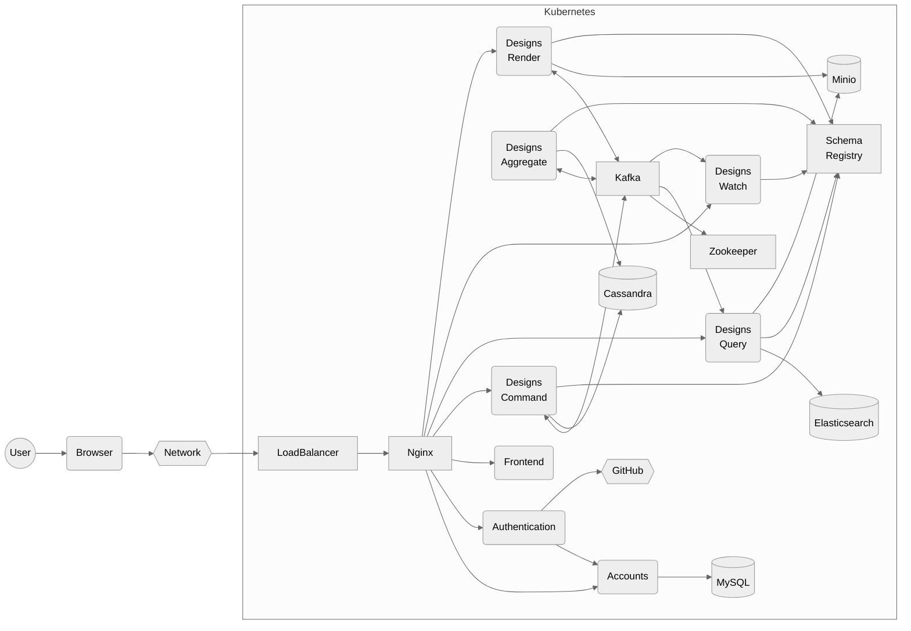

```mermaid
%%{init: {'theme':'neutral'}}%%
flowchart LR

    SDQ(Designs<BR>Query)
    SDC(Designs<BR>Command)
    SDA(Designs<BR>Aggregate)
    SDW(Designs<BR>Watch)
    SDR(Designs<BR>Render)
    SA(Accounts)
    SU(Authentication)
    SF(Frontend)
    
    K[Kafka]
    C[(Cassandra)]
    D[(MySQL)]
    E[(Elasticsearch)]
    M[(Minio)]
    N[Nginx]
    S[Schema<BR>Registry]
    Z[Zookeeper]
    G{{GitHub}}
    
    U((User))
    B(Browser)
    NT{{Network}}
    LB[LoadBalancer]

    U --> B
    B --> NT
    NT --> LB
    
    subgraph Kubernetes
    LB --> N
    K --> Z
    SDQ --> E 
    K --> SDQ
    SDQ --> S
    SDQ --> M
    SDC <--> K 
    SDC --> C 
    SDC --> S
    SDA <--> K
    SDA --> C 
    SDA --> S 
    K --> SDW 
    SDW --> S 
    SDR <--> K 
    SDR --> M 
    SDR --> S 
    SA --> D 
    SU --> SA
    SU --> G
    N --> SA 
    N --> SU 
    N --> SF
    N --> SDC 
    N --> SDQ 
    N --> SDW 
    N --> SDR 
    end
    
```